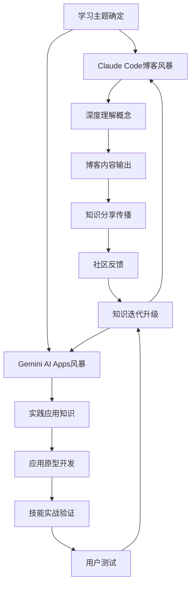

## 引言：AI时代的知识革命

在信息爆炸的时代，传统的学习方式已经无法满足终身学习者的需求。我们不仅需要快速获取知识，更要将知识转化为有价值的输出。本文将介绍两个革命性的概念：**Claude Code博客风暴**和**Gemini AI Apps风暴**，这两种方法将彻底改变你学习和创造知识的方式。

## 核心概念一：Claude Code博客风暴

### 什么是Claude Code博客风暴？

Claude Code博客风暴是一种基于AI辅助的批量博客创作方法论，它利用Claude Code的强大功能，在短时间内生成大量高质量的博客内容，同时通过创作过程深化对知识的理解。

### 核心原理

1. **输入-处理-输出循环加速**
   ```
   传统学习：阅读 → 理解 → 记忆 → 应用
   博客风暴：输入 → AI处理 → 即时输出 → 反馈优化
   ```

2. **知识外化促进内化**
   通过强制输出，将隐性知识转化为显性表达，加速理解和记忆

3. **主题聚类学习法**
   围绕核心主题，快速生成相关内容群，形成知识网络

### 实施步骤

#### 第一步：知识输入（15分钟）
```
快速输入策略：
- 速读3-5篇相关文章
- 观看1个教学视频（2倍速）
- 记录关键概念和疑问点
```

#### 第二步：AI辅助理解（10分钟）
```
Claude Code使用技巧：
- 请解释[概念]的核心要点
- 这个概念在实际中的应用场景有哪些？
- 有哪些常见的误解需要避免？
```

#### 第三步：博客框架生成（5分钟）
```
快速框架模板：
- 问题引入（痛点）
- 核心概念解释（简明扼要）
- 实际应用案例（3-5个）
- 常见误区澄清
- 行动建议清单
```

#### 第四步：内容创作风暴（30分钟）
```
批量创作技巧：
- 设定30分钟倒计时
- 不追求完美，先完成再完善
- 每10分钟一个小节
- AI辅助补充案例和数据
```

### 博客风暴工具包

#### 必备工具
- **Claude Code**：核心AI助手
- **Markdown编辑器**：快速格式化
- **思维导图工具**：梳理知识结构
- **番茄钟**：时间管理

#### 高效提示词库
```
# 知识解析类
"用简单的语言解释[复杂概念]，并给出3个生活化的例子"

# 内容生成类
"基于[主题]，生成一篇1500字的博客大纲，包含引言、核心内容、实践建议和结语"

# 优化完善类
"请检查这段内容的逻辑是否清晰，并提出3个改进建议"
```

## 核心概念二：Gemini AI Apps风暴

### 什么是Gemini AI Apps风暴？

Gemini AI Apps风暴是利用Google AI Studio的Build平台，快速将想法转化为功能性应用的方法论。它让非程序员也能在短时间内创建可用的应用原型，通过实践深化对技术和概念的理解。

### Google AI Studio Build平台优势

1. **零代码开发**：自然语言描述即可生成应用
2. **快速迭代**：几分钟内完成原型到成品的循环
3. **AI驱动**：内置Gemini模型的智能能力
4. **即时部署**：一键发布和分享

### 应用开发风暴流程

#### 阶段一：需求闪电定义（5分钟）
```
快速定义模板：
- 应用解决什么问题？
- 核心功能是什么？
- 目标用户是谁？
- 独特价值在哪里？
```

#### 阶段二：AI辅助设计（10分钟）
```
与Gemini对话示例：
"我想创建一个帮助用户学习[主题]的Web应用"
"它需要包含以下功能：1.知识卡片 2.测试模块 3.进度追踪"
"请帮我设计UI界面和技术实现方案"
```

#### 阶段三：快速原型开发（20分钟）
```
开发加速技巧：
- 使用现成模板和组件
- 优先核心功能，后期迭代
- AI辅助代码生成和调试
- 边开发边测试
```

#### 阶段四：反馈优化循环（15分钟）
```
快速验证方法：
- 立即使用自己的应用
- 邀请3个朋友测试
- 收集反馈并记录改进点
- 当天完成一轮优化
```

### 应用风暴创意库

#### 教育类应用
- **概念解释器**：输入复杂概念，生成多维度解释
- **记忆卡片生成器**：自动创建记忆卡片和复习计划
- **学习计划制定器**：基于目标自动生成学习计划

#### 生产力类应用
- **博客写作助手**：提供结构和内容建议
- **知识管理工具**：自动整理和关联笔记
- **创意生成器**：基于输入产生创新想法

#### 生活类应用
- **习惯追踪器**：游戏化的习惯养成
- **决策助手**：权衡分析帮助做决定
- **学习计时器**：结合番茄工作法和正念

## 双风暴融合：终极学习加速器

### 协同工作流



### 每日学习日程模板

#### 晨间（1小时）：博客风暴时间
```
06:30-06:45 主题选择和资料速览
06:45-07:00 AI辅助理解和框架生成
07:00-07:30 专注写作，完成初稿
```

#### 晚间（1小时）：应用风暴时间
```
20:00-20:15 复盘当天学习内容，确定应用方向
20:15-20:30 AI辅助设计和原型规划
20:30-21:00 专注开发，完成可用版本
```

## 终身学习者的方法论

### 1. 输出驱动输入原则

**传统学习误区**：先学完再输出
**风暴学习法**：边输出边学习，用输出倒逼输入

### 2. 快速循环迭代原则

```
学习 → 创作 → 反馈 → 改进 → 再创作
（每循环一次，理解加深一层）
```

### 3. 主题聚类学习原则

**横向拓展**：一个主题多角度探索
**纵向深入**：相关概念逐层深挖
**网络连接**：不同领域知识关联

### 4. 工具辅助增效原则

**不抗拒工具**：AI是认知的延伸
**不依赖工具**：保持独立思考能力
**善用工具**：让工具放大学习效果

## 实战案例：30天掌握机器学习基础

### 第1-10天：概念建立期
- 每天一个核心概念（过拟合、梯度下降、神经网络等）
- 博客风暴：解释概念 + 生活化比喻
- 应用风暴：创建可视化演示工具

### 第11-20天：实践深入期
- 动手实现简单算法
- 博客风暴：记录实现过程和心得
- 应用风暴：开发交互式学习工具

### 第21-30天：项目整合期
- 完成一个小型项目
- 博客风暴：项目复盘和经验总结
- 应用风暴：打包成教学应用分享

### 预期成果
- 30篇机器学习主题博客
- 10+个交互式学习应用
- 扎实的理论基础 + 实战经验
- 个人知识库和作品集

## 工具和资源清单

### 必备工具
- **Claude Code**：智能对话和代码生成
- **Google AI Studio**：应用开发和部署
- **Obsidian**：知识管理和连接
- **Notion**：项目规划和进度追踪

### 学习资源
- **快速输入源**：
  - arXiv每日论文摘要
  - 技术博客聚合平台
  - YouTube学习频道（2倍速观看）
  - 播客节目（碎片时间）

### 社区平台
- **GitHub**：分享代码和项目
- **Medium/知乎**：发布博客文章
- **Twitter**：分享学习心得
- **Discord/Slack**：加入学习社群

## 常见问题解答

### Q1: 这样快速创作，质量如何保证？
**A**: 质量通过迭代提升。第一版追求完成度，后续基于反馈持续优化。重要的是建立创作习惯。

### Q2: 不会编程也能做应用风暴吗？
**A**: 完全可以！Google AI Studio的Build平台支持自然语言开发。从简单应用开始，逐步学习基础概念。

### Q3: 如何避免信息过载？
**A**:
- 设定明确的主题边界
- 使用RSS聚合筛选优质信息源
- 定期整理和归档学习内容
- 专注一个领域深耕后再拓展

### Q4: AI辅助是否会削弱思考能力？
**A**: 关键在于使用方法。AI是思维的放大器，不是替代品。保持批判性思维，用AI激发灵感而非完全依赖。

## 进阶技巧

### 1. 自动化工作流
```python
# 示例：自动博客生成脚本
import requests
import json

def generate_blog_outline(topic):
    prompt = f"为主题'{topic}'生成详细的博客大纲，包含5个主要章节"
    # 调用Claude API
    response = call_claude_api(prompt)
    return response

def create_content_calendar(topics, days=30):
    calendar = {}
    for i, topic in enumerate(topics):
        calendar[f"Day {i+1}"] = {
            "topic": topic,
            "outline": generate_blog_outline(topic),
            "status": "pending"
        }
    return calendar
```

### 2. 数据分析优化
- 追踪哪些主题最受欢迎
- 分析阅读完成率和互动率
- 基于数据调整创作方向

### 3. 跨平台内容复用
- 一篇博客 → 多个社交媒体帖子
- 一个应用 → 系列教程文章
- 一次学习 → 多种输出形式

## 结语：成为AI时代的超级学习者

Claude Code博客风暴和Gemini AI Apps风暴不仅仅是工具使用方法，更是一种全新的学习范式。它让我们能够：

1. **以10倍速度学习和创造**
2. **将知识转化为实际价值**
3. **建立个人品牌和作品集**
4. **在AI辅助下保持竞争力**

### 行动呼吁

不要等待完美的时机，从今天开始：
1. 选择一个你感兴趣的主题
2. 用30分钟完成第一篇博客风暴
3. 用30分钟创建第一个AI应用
4. 分享你的成果，获得反馈
5. 明天继续，坚持30天

记住：在AI时代，最重要的不是你知道什么，而是你能多快学习、应用和分享新知识。

> "未来属于那些能够利用AI工具，将想法快速转化为现实的人。" —— 新时代的超级学习者

你准备好加入这场学习革命了吗？让我们一起用AI双风暴，打造属于自己的知识涡轮增压器！

## 资源获取

关注我们的GitHub仓库，获取：
- 完整的提示词库
- 自动化脚本模板
- 30天学习计划模板
- 社区讨论和答疑

开始你的AI学习风暴之旅吧！🚀