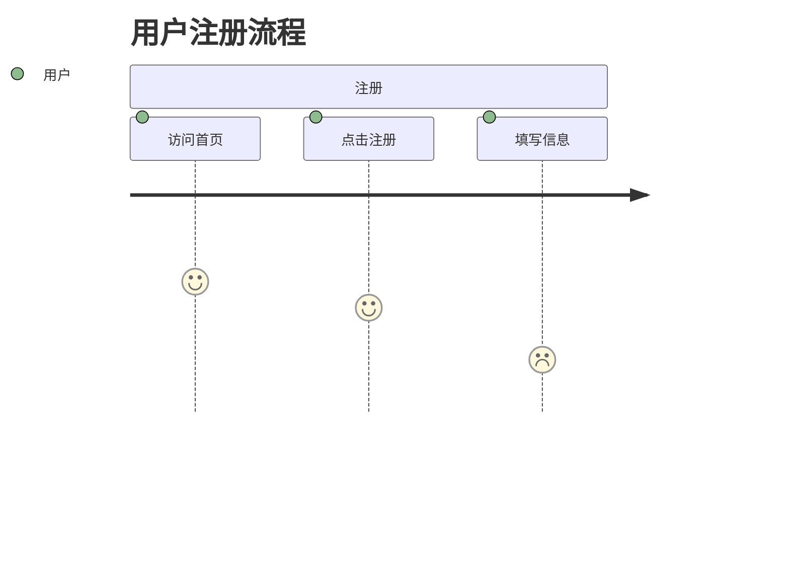

# 为什么说最好的笔记软件，是VS Code？

> **核心观点**：VS Code不仅是一个代码编辑器，它是一个基于认知科学原理设计的、可无限扩展的知识操作系统。当你真正理解它的设计理念时，你会发现它是终极的笔记神器。

## 引言：我的笔记工具进化史

五年前，我也是一个笔记工具收集者：
- 📝 Evernote - 收集了几千篇文章，再也没打开过
- 🐘 Notion - 花了一个月设计数据库，最后只用来记待办事项
- 🌳 Obsidian - 沉迷于插件和主题，忘了记笔记
- 📝 Typora - 写了几篇漂亮的文档，然后就吃灰了

直到我发现了VS Code作为笔记工具的真正威力。

## 一、为什么传统笔记工具都在「反人类」？

### 问题1：信息孤岛

**传统工具的问题**：
- Notion的块无法与本地文件互通
- Obsidian的数据被锁在.vault文件夹里
- Evernote的内容导出格式混乱

**VS Code的解决方案**：
- 基于纯文本文件（Markdown）
- 完全开放的文件系统
- 与所有工具无缝集成

### 问题2：认知负荷过重

**传统工具的界面**：
- 复杂的菜单和选项
- 过多的格式选择
- 干扰注意力的元素

**VS Code的设计理念**：
- 极简的界面设计
- 专注模式（Zen Mode）
- 命令驱动的操作方式

### 问题3：缺乏上下文切换

**大脑的工作原理**：
- 每次上下文切换都会消耗认知资源
- 频繁切换工具会降低效率
- 分散的信息难以形成知识体系

**VS Code的优势**：
- 所有工作在一个环境中完成
- 代码、文档、笔记统一管理
- 减少环境切换的认知成本

## 二、VS Code作为笔记工具的科学依据

### 依据1：基于文本的学习最有效

**认知科学研究**：
- 纯文本需要大脑主动处理，促进深度理解
- 富文本会分散注意力，降低学习效果
- Markdown的标记符号提供了适度的视觉提示

**VS Code的实现**：
- 原生Markdown支持
- 语法高亮增强可读性
- 实时预览功能

### 依据2：键盘操作比鼠标操作更高效

**人机交互研究**：
- 键盘操作的认知负荷更低
- 肌肉记忆形成后效率提升300%
- 减少手眼协调的需求

**VS Code的优势**：
- 几乎所有操作都有快捷键
- 命令面板（Ctrl+Shift+P）统一入口
- 可自定义的键盘映射

### 依据3：可定制性符合个体差异

**学习科学发现**：
- 每个人的认知风格不同
- 固定的界面无法满足所有人
- 个性化工具能显著提升效率

**VS Code的灵活性**：
- 高度可定制的界面
- 丰富的插件生态
- 可配置的快捷键和工作流

## 三、终极VS Code笔记系统配置

### 基础配置

**必装插件**：

1. **Markdown All in One**
   - 快捷键：Ctrl+B 粗体，Ctrl+I 斜体
   - 自动生成目录
   - 格式化表格

2. **Paste Image**
   - Ctrl+Alt+V 粘贴图片
   - 自动保存到指定文件夹
   - 生成标准Markdown图片语法

3. **Markdown Preview Enhanced**
   - 实时预览
   - 支持数学公式、图表
   - 导出PDF/HTML

4. **Foam**（可选）
   - 双向链接
   - 图谱可视化
   - 类似Obsidian的体验

### 高级配置

**settings.json**配置：

```json
{
  // 编辑器配置
  "editor.fontSize": 16,
  "editor.lineHeight": 1.6,
  "editor.wordWrap": "on",
  "editor.minimap.enabled": false,

  // Markdown配置
  "[markdown]": {
    "editor.wordWrap": "on",
    "editor.quickSuggestions": true
  },

  // 文件关联
  "files.associations": {
    "*.md": "markdown"
  },

  // 工作区配置
  "workbench.colorTheme": "GitHub Theme",
  "workbench.iconTheme": "vscode-icons"
}
```

### 工作流设计

**我的典型工作流**：

1. **晨间笔记**（Daily Note）
   ```markdown
   # 2025-11-27 - 星期四

   ## 🎯 今日目标
   - [ ] 完成VS Code笔记文章
   - [ ] 复习认知科学文献

   ## 💡 灵感记录
   - VS Code的Zen Mode相当于认知科学中的"专注模式"

   ## 📊 时间日志
   - 09:00-11:00 写作
   - 14:00-16:00 研究
   ```

2. **项目笔记**（Project Note）
   ```markdown
   # 认知凤凰社博客项目

   ## 📋 内容规划
   - [x] VS Code笔记系统
   - [ ] AI学习方法论
   - [ ] 一人公司实践

   ## 🔗 相关资源
   - [[认知科学基础]]
   - [[笔记方法论]]
   - [[内容创作流程]]
   ```

3. **文献笔记**（Literature Note）
   ```markdown
   # 关于认知负荷理论的文献

   ## 📖 核心观点
   工作记忆容量有限，教学设计应减少无关认知负荷

   ## 💭 个人思考
   这解释了为什么VS Code的极简界面更有效

   ## 🔗 相关概念
   - [[工作记忆]]
   - [[注意力资源]]
   ```

## 四、VS Code笔记系统的高级技巧

### 技巧1：多光标编辑

**应用场景**：批量修改相似内容

**操作方法**：
- Alt+Click：添加光标
- Ctrl+Alt+Up/Down：上下添加光标
- Ctrl+D：选择下一个相同内容

**实际案例**：
同时修改多个待办事项的状态：
```markdown
- [ ] 任务1
- [ ] 任务2
- [ ] 任务3
```
选中所有`[ ]`，一次性改为`[x]`

### 技巧2：代码片段（Snippets）

**创建自定义片段**：

```json
{
  "Daily Note Template": {
    "prefix": "daily",
    "body": [
      "# $1 - $(date +%Y-%m-%d)",
      "",
      "## 🎯 今日目标",
      "- [ ] $2",
      "",
      "## 💡 灵感记录",
      "- $3",
      "",
      "## 📊 时间日志",
      "- "
    ],
    "description": "Create daily note"
  }
}
```

**使用方法**：
输入`daily`，按Tab键自动生成模板

### 技巧3：任务集成

**使用TODO插件**：

```json
{
  "todo-tree.general.tags": [
    "BUG",
    "HACK",
    "FIXME",
    "TODO",
    "NOTE"
  ],
  "todo-tree.highlights.defaultHighlight": {
    "gutterIcon": true
  }
}
```

**在笔记中使用**：
```markdown
# 项目规划

## TODO 优化网站性能
- [ ] 压缩图片资源
- [ ] 启用CDN
- FIXME 修复移动端显示问题

## NOTE 关于用户体验
用户反馈页面加载速度需要优化
```

### 技巧4：Git集成版本控制

**为什么笔记需要版本控制？**
- 追踪思维演变过程
- 防止意外丢失
- 支持多设备同步

**工作流**：
```bash
# 初始化Git仓库
git init

# 添加所有笔记
git add .

# 提交更改
git commit -m "$(date +%Y-%m-%d) 笔记更新"

# 推送到远程仓库（GitHub/GitLab）
git push origin main
```

### 技巧5：多工作区管理

**项目结构**：
```
Notes/
├── Daily/          # 日常笔记
├── Projects/       # 项目笔记
├── Literature/     # 文献笔记
├── Templates/      # 模板文件
├── Archive/        # 归档笔记
└── Assets/         # 图片资源
```

**VS Code工作区配置**：
```json
{
  "folders": [
    {
      "path": "Daily",
      "name": "📅 日常"
    },
    {
      "path": "Projects",
      "name": "🚀 项目"
    },
    {
      "path": "Literature",
      "name": "📚 文献"
    }
  ],
  "settings": {
    "files.exclude": {
      "Archive/**": true
    }
  }
}
```

## 五、VS Code vs 其他笔记工具对比

### VS Code vs Obsidian

| 特性 | VS Code | Obsidian |
|-----|---------|----------|
| 文本编辑能力 | ⭐⭐⭐⭐⭐ | ⭐⭐⭐ |
| 插件生态 | ⭐⭐⭐⭐⭐ | ⭐⭐⭐⭐ |
| 图谱视图 | ⭐⭐ (需插件) | ⭐⭐⭐⭐⭐ |
| 启动速度 | ⭐⭐⭐⭐ | ⭐⭐⭐⭐⭐ |
| 学习成本 | ⭐⭐ | ⭐⭐⭐ |
| 文件开放性 | ⭐⭐⭐⭐⭐ | ⭐⭐⭐⭐ |
| 代码集成 | ⭐⭐⭐⭐⭐ | ⭐⭐ |

### VS Code vs Notion

| 特性 | VS Code | Notion |
|-----|---------|---------|
| 离线使用 | ⭐⭐⭐⭐⭐ | ⭐⭐ |
| 导出自由度 | ⭐⭐⭐⭐⭐ | ⭐⭐ |
| 数据库功能 | ❌ | ⭐⭐⭐⭐⭐ |
| 协作功能 | ⭐⭐ | ⭐⭐⭐⭐⭐ |
| 界面美观度 | ⭐⭐⭐ | ⭐⭐⭐⭐⭐ |
| 性能 | ⭐⭐⭐⭐⭐ | ⭐⭐⭐ |

### VS Code vs 传统笔记软件

**优势总结**：
- ✅ 完全免费
- ✅ 无厂商锁定
- ✅ 极限可定制
- ✅ 与开发工作流无缝集成
- ✅ 强大的文本处理能力
- ✅ 版本控制天然支持

**劣势分析**：
- ❌ 需要一定学习成本
- ❌ 缺少原生移动端
- ❌ 协作功能有限
- ❌ 界面相对技术向

## 六、实际使用案例分享

### 案例1：学术研究笔记系统

**用户背景**：认知科学博士生

**配置方案**：
```
├── Papers/           # 论文笔记
│   ├── Reading/
│   └── Notes/
├── Experiments/      # 实验记录
├── Conferences/      # 会议笔记
└── Ideas/           # 研究想法
```

**关键插件**：
- LaTeX Workshop：数学公式
- Markdown PDF：快速导出
- Git Graph：版本可视化

**使用效果**：
"相比Zotero+Word的组合，VS Code让我能够在同一个环境中完成文献阅读、笔记记录和论文写作，效率提升了至少50%。"

### 案例2：产品经理知识库

**用户背景**：SaaS产品经理

**特色配置**：
- 使用Mermaid绘制产品流程图
- 用表格管理竞品分析
- 通过任务列表跟踪项目进度

**定制功能**：
```markdown
## 竞品分析模板

| 产品 | 核心功能 | 价格 | 优势 | 劣势 |
|-----|---------|------|------|------|
| 产品A | xxx | $99 | ... | ... |

## 用户旅程图


```

### 案例3：开发者学习笔记

**特色功能**：
- 代码片段收集
- 技术文档整理
- 项目经验总结

**实用技巧**：
```markdown
## 代码片段：快速排序

```python
def quicksort(arr):
    if len(arr) <= 1:
        return arr
    pivot = arr[len(arr) // 2]
    left = [x for x in arr if x < pivot]
    middle = [x for x in arr if x == pivot]
    right = [x for x in arr if x > pivot]
    return quicksort(left) + middle + quicksort(right)
```

## 关键概念

**时间复杂度**: O(n log n)
**空间复杂度**: O(log n)
**稳定性**: 不稳定排序
```

## 七、开始使用VS Code笔记系统的步骤

### 第一步：基础设置（15分钟）

1. 下载安装VS Code
2. 安装推荐的Markdown插件
3. 创建工作文件夹
4. 配置基础设置

### 第二步：模板创建（30分钟）

1. 设计日常笔记模板
2. 创建项目笔记模板
3. 设置代码片段
4. 配置任务标记

### 第三步：工作流建立（1小时）

1. 设计文件组织结构
2. 建立命名规范
3. 配置Git版本控制
4. 创建备份策略

### 第四步：高级优化（持续）

1. 探索更多插件
2. 优化快捷键配置
3. 建立自动化流程
4. 定期回顾和调整

## 八、常见疑问解答

### Q1：VS Code适合非技术人员吗？

**答案**：经过适当配置后，VS Code的界面可以比大多数专业笔记软件更简洁。关键是预先配置好模板和快捷键，隐藏不需要的功能。

### Q2：没有移动端怎么办？

**解决方案**：
- 使用Git同步，手机端用Markdown编辑器查看
- 通过GitHub网页版快速浏览
- 定期导出为PDF在移动设备阅读

### Q3：图片管理方便吗？

**最佳实践**：
- 使用Paste Image插件一键粘贴
- 统一图片命名规范（日期+描述）
- 定期归档旧图片
- 考虑使用图床服务

### Q4：搜索功能如何？

**VS Code的搜索优势**：
- 支持正则表达式
- 可以搜索特定文件夹
- 支持大小写敏感/不敏感
- 可以排除某些文件类型
- 搜索结果有上下文预览

### Q5：协作功能弱怎么办？

**解决方案**：
- 使用Git + GitHub进行版本协作
- 通过GitHub Issues进行讨论
- 使用Pull Request进行内容审核
- 虽然不是实时协作，但更利于深度内容创作

## 结语：VS Code笔记系统的哲学

使用VS Code作为笔记工具，不仅仅是选择一个软件，更是选择一种理念：

- **开放性**：拒绝厂商锁定，数据完全自主
- **可定制性**：根据个人需求打造专属系统
- **效率优先**：用键盘驱动的极速体验
- **深度整合**：让笔记成为工作流程的一部分

**不是每个人都适合VS Code笔记系统**，但如果你是：
- 🚀 追求效率的极客
- 📝 喜欢Markdown的写作者
- 💻 经常处理代码的开发者
- 📊 需要高度定制的高级用户

那么，VS Code很可能是你的终极笔记解决方案。

---

## 资源下载

**我的VS Code配置**：
- settings.json
- keybindings.json
- 常用代码片段
- Markdown模板集合

**获取方式**：
关注微信公众号「认知凤凰社」，回复「vscode笔记」获取下载链接。

---

## 下一步行动

1. **立即行动**：下载VS Code，开始你的第一个Markdown笔记
2. **逐步优化**：根据需要添加插件和配置
3. **建立习惯**：每天使用，形成肌肉记忆
4. **持续改进**：定期回顾和优化你的工作流

记住：**最好的笔记系统不是功能最多的，而是你最愿意使用的。**

如果VS Code能让你更愿意记录、整理和回顾知识，那它就是对你来说最好的笔记软件。

---

*本文首发于认知凤凰社，基于我的实际使用经验和认知科学原理。如果你对效率工具和知识管理感兴趣，欢迎关注更多相关内容。*